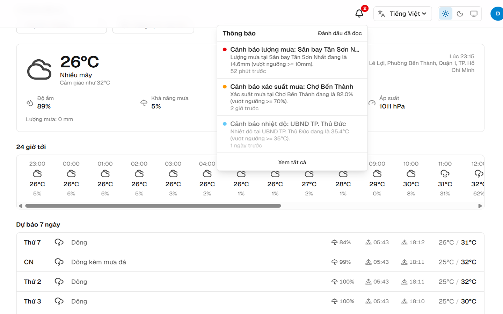
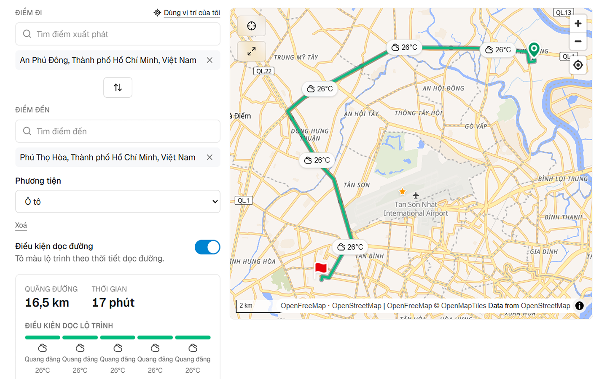
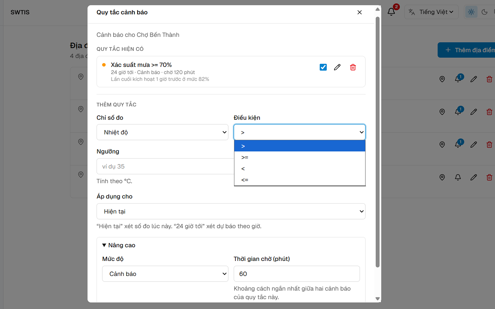
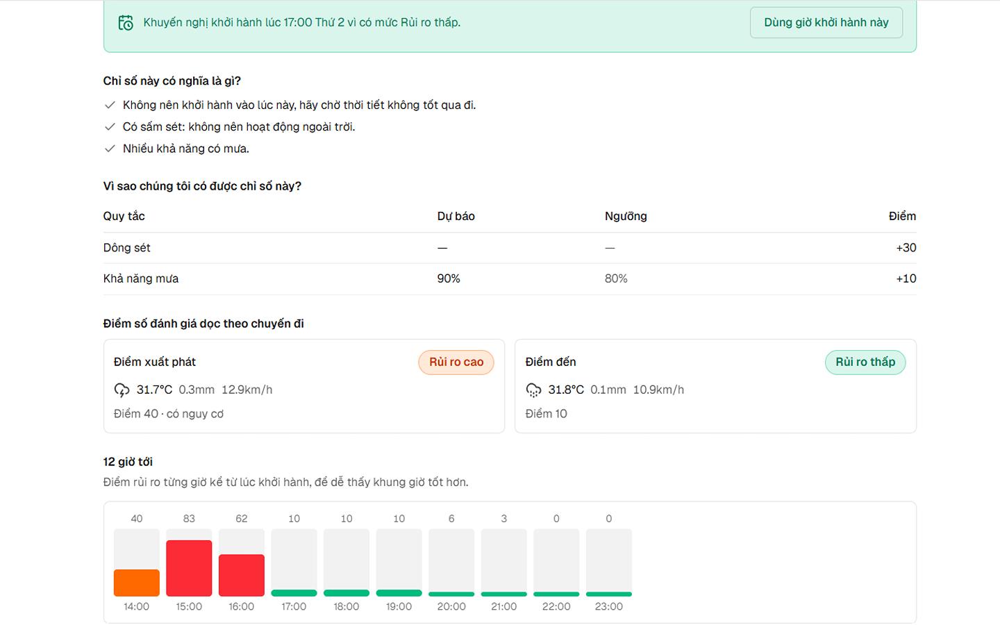
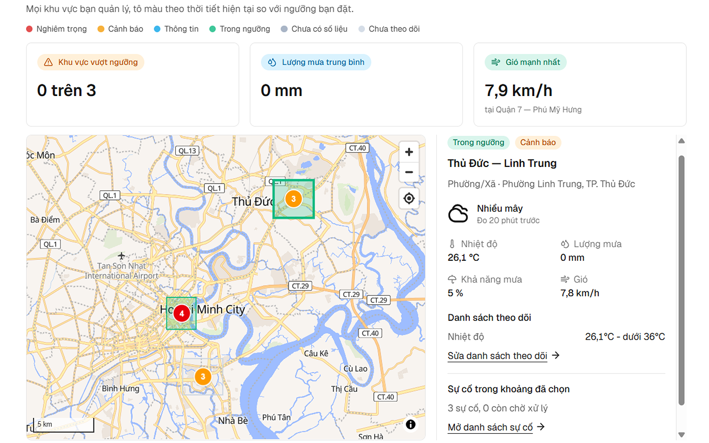
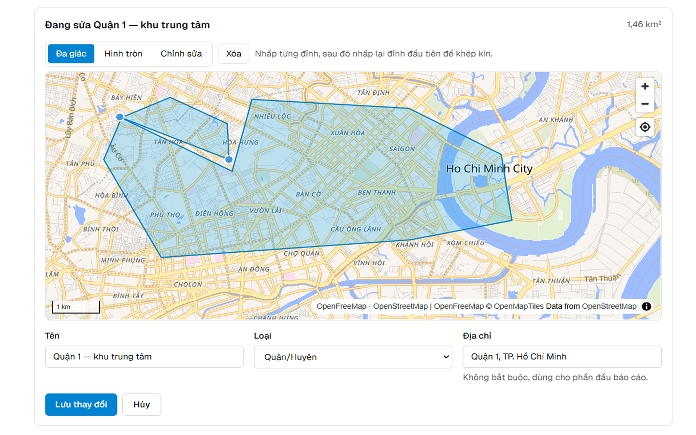

# SWTIS: Weather service for urban transportation

<p align="center">
  
  
  
  
  
  
  
  <!--  -->
</p>

Turns weather forecasts for Ho Chi Minh City into decisions for three roles:

- **Commuters:** personal weather alerts for daily travel
- **Businesses:** delivery-window risk scoring
- **City officers:** an incident and response console

One weather source, adapted for three kinds of users.

---

## Status

**Feature-complete, pre-deployment:** Everything listed below runs against a real Postgres database, and there are 473 automated tests across the API and frontend. There's no live demo yet, I haven't hosted it, and CI is set to manual dispatch until deployment is sorted out. To try it, run it locally using the [Getting started](#getting-started) steps.

---

## Screenshots

<table>
  <tr>
    <td width="50%"></td>
    <td width="50%"></td>
  </tr>
  <tr>
    <td><b>Weather</b> - current conditions and the hourly strip for a saved place, alert inbox open in the header</td>
    <td><b>Map</b> - a planned route with the weather reported for each leg of the trip</td>
  </tr>
  <tr>
    <td></td>
    <td></td>
  </tr>
  <tr>
    <td><b>Alerts</b> - threshold rules per location: metric, operator, severity, and when each last fired</td>
    <td><b>Business</b> - a delivery window scored for risk, with the factors behind the number</td>
  </tr>
  <tr>
    <td></td>
    <td></td>
  </tr>
  <tr>
    <td><b>Government</b> - incident dashboard: KPI cards, the live incident list, per-area tally</td>
    <td><b>Government</b> - drawing an area of responsibility as an editable polygon</td>
  </tr>
</table>

---

## Key features

**Everyone**

- Email + password auth with OTP verification, password reset, and Google sign-in
- Saved locations with current conditions and hourly/daily forecasts
- Map with place search, reverse geocoding, and a route planner that reports the weather along each leg
- Saved routes, search history, and PDF export of a route weather report
- Alert rules per location, include: metric, operator, threshold, and severity delivered as live toasts over a WebSocket, into a notification inbox, and optionally as web push when no tab is open
- English/Vietnamese and light/dark, both persisted per account and applied before first paint

**Business accounts**

- Delivery-window risk assessment for a place or a whole route
- Scheduled and on-demand condition reports, charted and exportable to PDF

**Government officers** (the `admin` role)

- Draw and manage areas of responsibility as polygons
- Area alert rules that raise incidents when a measurement crosses a threshold
- Incident dashboard with severity/status filters and an incident heatmap
- Response scenarios that can be activated against an incident
- Aggregate area reports: daily trend, per-measurement breakdown, response-time statistics, plan usage, emailed on a schedule or exported to PDF

The `admin` role is granted by an existing administrator through `PUT /api/users/:id/roles`. Signup accepts `individual` or `business` only.

**Under the hood**

- 70 REST endpoints across 13 domain modules, 20 PostgreSQL tables, 21 reversible migrations
- Every third-party service is free and keyless, no API key to obtain, rotate, or pay for
- All upstream calls are server-side, behind per-route rate limits and a TTL cache (10 min current conditions, 1h forecasts, 24h reverse geocodes)
- Background workers for alert evaluation, report delivery, and cleanup, each wrapped in `pg_try_advisory_lock` so two API instances never double-send
- 473 tests — 238 backend cases driven through `supertest` against a real PostgreSQL database, 235 Vitest cases on the frontend

---

## Tech stack

| Layer    | What                                                                                                                                |
| -------- | ----------------------------------------------------------------------------------------------------------------------------------- |
| Frontend | Next.js 16 (App Router), React 19, TypeScript 5, Tailwind CSS v4, TanStack Query, React Hook Form + Zod, next-intl, Recharts, jsPDF |
| Map      | MapLibre GL via react-map-gl, terra-draw for polygon editing, OpenFreeMap tiles                                                     |
| Backend  | Node.js 20+, Express 5, Sequelize 6, Joi, JWT with rotating refresh tokens, `ws` WebSockets, web-push, Nodemailer, Pino             |
| Data     | PostgreSQL 18, umzug migrations, Docker Compose for dev and test databases                                                          |
| External | Open-Meteo (forecasts), Photon (geocoding), OSRM (routing), OpenFreeMap (tiles)                                                     |
| Testing  | `node --test` + supertest against a real database, Vitest + Testing Library, GitHub Actions                                         |

---

## Getting started

### Requirements

- Node.js 20+
- Docker (for PostgreSQL), or a local PostgreSQL 16+

The only optional credentials are SMTP for real mail, a Google OAuth client ID, and a VAPID key pair for web push.

### 1. Install

```bash
git clone https://github.com/hienhanhnguyen/weather_urban_traffic.git
npm run install:all
```

### 2. Database

```bash
cd backend
docker compose up -d          # dev DB on :5433, test DB on :5434
```

### 3. Environment

```bash
cp backend/.env.example backend/.env
cp frontend/.env.example frontend/.env.local
```

Fill in `JWT_ACCESS_SECRET` in `backend/.env` - at least 32 characters

```bash
node -e "console.log(require('crypto').randomBytes(48).toString('base64url'))"
```

Everything else has a working default. Leaving `SMTP_HOST` empty logs mail to the console instead of sending it.

### 4. Migrate

```bash
cd backend
npm run migrate               # dev database
npm run migrate:test          # test database
```

### 5. Run

Two terminals, from the repository root:

```bash
npm run dev:backend           # http://localhost:3000
npm run dev:frontend          # http://localhost:3001
```

Sign up at <http://localhost:3001/signup>. The verification OTP is printed to the
backend console while `SMTP_HOST` is empty.

### 6. Reach the government officer role

Grant yourself the `admin` role, either through `PUT /api/users/:id/roles` as an
existing admin, or directly in the database:

```sql
INSERT INTO user_role (user_id, role_id)
SELECT u.user_id, r.role_id
FROM user_account u, role r
WHERE u.email = 'you@example.com' AND r.name = 'admin';
```

---

## Layout

```
.
├── backend/
│   ├── src/
│   │   ├── modules/      one folder per domain: routes, controller, service,
│   │   │                 schemas, models: auth, users, locations, weather,
│   │   │                 alerts, geo, routing, business, analysis, areas,
│   │   │                 incidents, scenarios, govreports
│   │   ├── jobs/         alert evaluation, report delivery, cleanup
│   │   ├── realtime/     WebSocket upgrade, connection hub, web push
│   │   ├── db/           umzug migrations
│   │   └── shared/       config, database, auth middleware, errors, mailer
│   ├── scripts/migrate.js
│   └── tests/
├── frontend/
│   └── src/
│       ├── app/          App Router: (auth) and (app) route groups
│       ├── features/     one folder per feature, colocated with its API layer
│       ├── components/   shared UI primitives
│       ├── lib/          api client, auth, i18n plumbing, map config, PDF
│       └── i18n/         next-intl setup and en/vi message catalogues
└── docs/                 screenshots/
```
